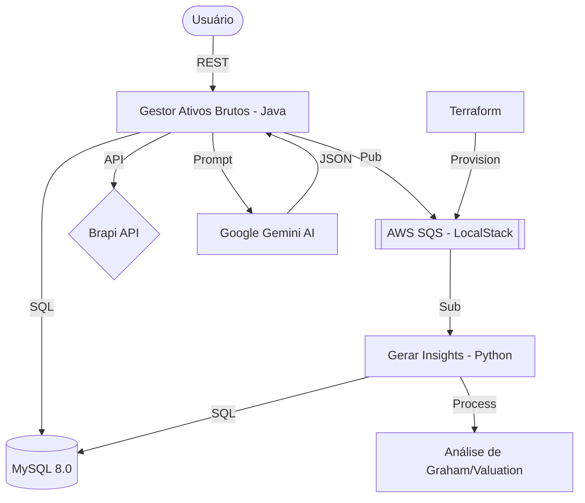

# B3 Monitoring & AI Insights Ecosystem 

Este ecossistema foi projetado para monitorar ativos da bolsa brasileira (B3) em tempo real, processar dados fundamentalistas de forma distribuída e gerar análises preditivas/quantitativas utilizando Inteligência Artificial (Google Gemini).

## ️ Arquitetura do Sistema

O sistema utiliza uma arquitetura baseada em eventos e microserviços, garantindo escalabilidade e resiliência.



## ️ Componentes e Tecnologias

### 1. Gestor Ativos Brutos (Java 21 + Spring Boot 3)
O núcleo do sistema. Responsável por:
- Exposição da API REST para usuários.
- Integração com a API Brapi para cotações.
- Orquestração de mensagens via SQS.
- Consolidação de dados para análise de IA.
- **Tecnologias**: Spring WebFlux, JPA/Hibernate, AWS SDK, Google GenAI SDK.

### 2. Gerar Insights (Python 3.12)
Worker especializado em cálculos matemáticos e fundamentalistas:
- Consome mensagens da fila `tratar-ativos`.
- Calcula Preço Justo de Graham e Margens de Segurança.
- Persiste os resultados brutos no MySQL para posterior análise da IA.
- **Tecnologias**: Boto3, MySQL Connector, Pydantic.

### 3. Infraestrutura & Mensageria
- **LocalStack**: Emula o ambiente AWS (SQS) localmente.
- **Terraform**: Automatiza a criação das filas e permissões.
- **MySQL 8.0**: Base de dados central para histórico e insights calculados.

##  Como Executar

### Pré-requisitos
- Docker & Docker Compose
- Chave de API do Gemini (Google AI Studio)

### Configuração
Crie um arquivo `.env` na raiz ou exporte a variável:
```bash
export GEMINI_API_KEY=sua_chave_aqui
```

### Inicialização
```bash
# Sobe todo o ecossistema
docker-compose up -d --build
```

##  Endpoints Principais

### Monitoramento de Ativos
- `GET /ativos/{simbolo}`: Retorna a cotação atual e dados da empresa.
- `POST /ativos/registrar/{simbolo}`: Adiciona o ativo à fila de monitoramento periódico.

### Inteligência Artificial (Insights)
- `GET /insights/{simbolo}/analise`: Consolida os dados fundamentalistas calculados pelo worker Python e gera uma análise qualitativa via Gemini.
    - **Header Opcional**: `X-Gemini-Key` para usar uma chave dinâmica.

## ⚙️ Configurações Importantes e Variáveis Dinâmicas

Todo o ecossistema é altamente configurável de forma dinâmica por meio de variáveis de ambiente. Ao disponibilizar as imagens no Docker Hub ou ao executá-las localmente, você pode customizar os seguintes parâmetros:

### Variáveis Globais (Infraestrutura)
| Variável | Descrição | Valor Padrão |
|----------|-----------|--------------|
| `SERVER_PORT` | Porta onde o serviço Java escutará | `8091` |
| `AWS_SQS_ENDPOINT_BASE` | Endpoint do LocalStack | `http://localstack:4566` |
| `GEMINI_API_KEY` | Chave de acesso ao Google Gemini | `AIzaSyBkAO5F4f...` (Default de fallback) |

### Variáveis do Banco de Dados (MySQL)
| Variável | Descrição | Valor Padrão |
|----------|-----------|--------------|
| `DB_URL` / `DB_HOST` | URL/Host de conexão com o MySQL | `jdbc:mysql://mysql:3306/minha_base` / `mysql` |
| `DB_USERNAME` / `DB_USER` | Usuário de conexão do banco | `spring` |
| `DB_PASSWORD` / `DB_PASS` | Senha de conexão do banco | `spring123` |
| `DB_NAME` | Nome do schema no MySQL | `minha_base` |

> [!TIP]
> Você pode passar essas variáveis diretamente no arquivo `.env` da raiz ou no bloco `environment` do seu `docker-compose.yml` para que as imagens se autoconfigurem dinamicamente com base nas suas credenciais reais de banco ou provedor de nuvem.

##  Arquivos de exemplo de variáveis de ambiente (imagens)

Para facilitar a execução das imagens Docker e a configuração local, o repositório contém arquivos de exemplo com as variáveis necessárias para cada serviço.

- `gerar-insights/.env.example` — variáveis usadas pelo worker Python em execução local
- `gerar-insights/env/.env.docker.example` — variáveis para execução dentro do container (usadas por `ENVIRONMENT=docker`)
- `gestor-ativos-brutos/.env.example` — variáveis para a aplicação Java (Spring Boot)

Copie o arquivo de exemplo adequado e ajuste os valores antes de subir o ambiente. Exemplo:

```bash
cp gerar-insights/.env.example gerar-insights/.env.local
cp gerar-insights/env/.env.docker.example gerar-insights/env/.env.docker
cp gestor-ativos-brutos/.env.example gestor-ativos-brutos/.env
```

Esses arquivos permitem que as imagens sejam executadas sem a necessidade de editar o `docker-compose.yml`.

##  Documentação Técnica
A especificação completa da API pode ser encontrada no arquivo [openapi.yaml](./openapi.yaml).
